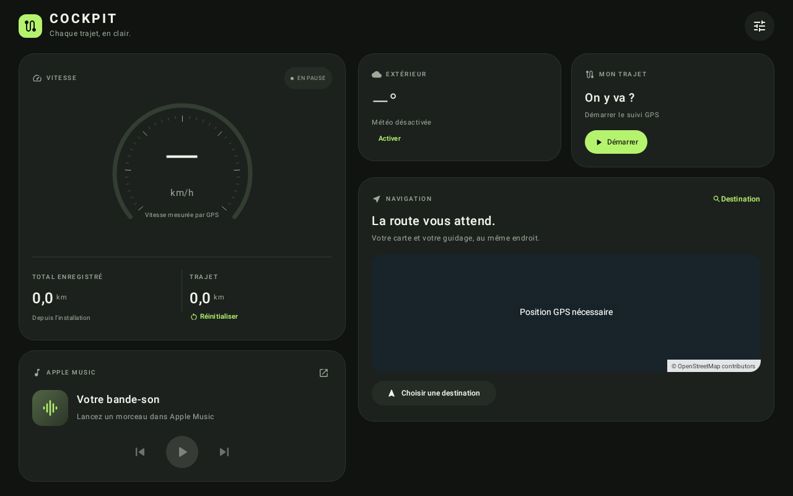

# Cockpit

Application Android native en français : tableau de bord sombre, navigation propre à l’application, commandes Apple Music et mesures GPS. Android 10 ou plus récent.

[Télécharger l’APK de test](https://github.com/Anth-off/car-dashboard/releases/download/v0.1.0/cockpit-0.1-debug.apk) · [Paquet AAB pour le partage interne Google Play](https://github.com/Anth-off/car-dashboard/releases/download/v0.1.0/cockpit-0.1-debug.aab) · [Tous les fichiers de la version 0.1](https://github.com/Anth-off/car-dashboard/releases/tag/v0.1.0)



**Version 0.1 : prototype personnel.** Le téléphone utilise une interface Jetpack Compose personnalisée. L’écran Android Auto utilise les modèles de navigation de Google et une carte sur surface projetée : son apparence diffère du téléphone. Une compilation réussie ne valide ni le fonctionnement sur chaque autoradio ni l’acceptation Google Play.

## Fonctions

- Vitesse GPS ; affichage « — » si le signal est absent ou périmé.
- Distance totale enregistrée par l’application, conservée entre sessions.
- Compteur trajet distinct, réinitialisable quand le suivi est arrêté.
- Vraie carte OpenStreetMap, itinéraire automobile OSRM, instructions françaises et guidage vocal.
- Destinations favorites locales ; recherche d’adresse via le service de géocodage Android, saisie manuelle de coordonnées en alternative.
- Détection de sortie d’itinéraire et recalcul explicite.
- Lecture/pause, précédent/suivant et métadonnées de la session Apple Music active.
- Température météo extérieure Open-Meteo, optionnelle, avec date de mise à jour.
- Android Auto : destinations, carte et guidage, panneau de trajet, commandes musicales.

Les compteurs mesurent **uniquement les déplacements enregistrés pendant le suivi GPS**. Ils ne lisent pas le compteur kilométrique du véhicule. Les tunnels, mauvaises positions et arrêts de l’application peuvent laisser des distances non enregistrées. La température n’est pas une mesure d’un capteur de la voiture.

## Essayer sur le téléphone

1. Installer l’APK de test, ouvrir Cockpit et autoriser la localisation **précise** lors du démarrage du suivi. Le suivi se lance depuis l’application visible et reste signalé par une notification.
2. Dans les réglages Cockpit, activer la météo si souhaité. Autoriser les notifications Android pour voir le suivi et les indications hors de l’application.
3. Pour la musique, accorder à Cockpit l’accès spécial aux notifications, puis ouvrir Apple Music et lancer un morceau. Le contrôle nécessite une session Apple Music active ; l’application ne fournit ni abonnement ni catalogue musical.
4. Choisir une destination, rechercher une adresse ou enregistrer des coordonnées. Accepter l’utilisation du calcul d’itinéraire en ligne, puis attendre une position GPS.
5. Arrêter le suivi pour mettre fin à l’enregistrement. Le compteur trajet reste conservé jusqu’à sa remise à zéro ; le total reste conservé.

Les versions Android récentes peuvent limiter l’accès aux notifications pour une application installée manuellement. Le téléphone indique alors les réglages supplémentaires disponibles dans sa fiche d’application. Cockpit n’active aucune permission automatiquement.

## Essayer sur Android Auto

L’installation directe de l’APK permet de tester **le téléphone**. Pour une application basée sur la Car App Library, l’option Android Auto « Sources inconnues » ne suffit pas à la rendre disponible sur l’autoradio.

La voie officielle pour un véhicule réel est l’**Internal App Sharing** ou une piste de test interne dans **Google Play Console**, puis l’installation par le lien Google Play avec le compte testeur. Le partage interne d’applications accepte des versions de débogage ; une piste de test classique nécessite une version release et votre signature d’envoi. Le compte Play Console et les éventuelles exigences de configuration doivent être fournis par le propriétaire du projet. Aucun envoi ou déploiement sur Google Play n’est effectué par ce dépôt.

1. Charger un APK/AAB accepté par le canal choisi dans votre Play Console.
2. Installer Cockpit depuis son lien de test, préparer les autorisations et les favoris sur le téléphone, à l’arrêt.
3. Démarrer le suivi GPS depuis le téléphone, connecter Android Auto, puis ouvrir Cockpit dans le lanceur d’applications.
4. Choisir une destination enregistrée. La navigation et la carte sont propres à Cockpit ; Waze n’est pas intégré.

Le service est déclaré comme application **NAVIGATION** et implémente le calcul d’itinéraire et les instructions virage par virage. La conformité complète doit encore être vérifiée dans le Desktop Head Unit et sur véhicule avant distribution. Le rendu personnalisé Compose du téléphone ne remplace pas le lanceur Android Auto.

Le [Desktop Head Unit officiel](https://developer.android.com/training/cars/testing/dhu) permet de poursuivre les tests de projection. Le rappel de simulation Android Auto suit un itinéraire réellement calculé et marque ses instructions « Simulation » ; il ne modifie pas les compteurs GPS.

## Compiler

Ouvrir ce dossier dans Android Studio, installer le SDK Android 35 et utiliser un JDK complet 17 ou 21. Le projet utilise Gradle 8.13, AGP 8.9.2 et Kotlin 2.1.20.

```sh
./gradlew :app:assembleDebug :app:testDebugUnitTest :app:lintDebug
./gradlew :app:bundleDebug
```

Fichiers produits :

- `app/build/outputs/apk/debug/app-debug.apk`
- `app/build/outputs/bundle/debug/app-debug.aab`
- `app/build/reports/tests/testDebugUnitTest/index.html`
- `app/build/reports/lint-results-debug.html`

La signature debug est réservée aux essais. Une distribution publique nécessite votre configuration de signature, votre identifiant d’application et la validation de toutes les exigences Android Auto. Le projet ne contient aucune clé privée, aucun jeton et aucune clé API de fournisseur.

## Données, fournisseurs et limites

- Les compteurs et les favoris sont stockés uniquement dans les préférences locales. Aucune trace GPS n’est conservée ; la sauvegarde cloud Android est désactivée.
- La position actuelle et la destination sont transmises à `router.project-osrm.org` pour calculer l’itinéraire. C’est un serveur public de démonstration : **pas de garantie de disponibilité, pas de trafic en direct**. Prévoir un fournisseur ou une instance OSRM dédiée pour un usage distribué.
- Les tuiles affichées sont demandées à `tile.openstreetmap.org`. Cache HTTP respecté, seules les tuiles visibles sont chargées, aucun téléchargement massif. Une connexion reste nécessaire pour les zones absentes du cache. Attribution permanente : [© OpenStreetMap contributors](https://www.openstreetmap.org/copyright), données sous ODbL. Respecter la [politique des tuiles](https://operations.osmfoundation.org/policies/tiles/) et prévoir un fournisseur adapté pour une application diffusée largement.
- La météo désactivée par défaut transmet une position arrondie à deux décimales à [Open-Meteo](https://open-meteo.com/) au maximum toutes les 15 minutes pendant le suivi. Les relevés et coordonnées météo ne sont pas persistés. Vérifier les conditions du fournisseur pour une diffusion commerciale.
- La recherche d’adresse utilise le fournisseur `Geocoder` configuré sur le téléphone ; ses conditions et sa disponibilité dépendent de l’appareil.
- L’accès spécial aux notifications est étendu au niveau Android. Le code n’utilise que les sessions média du package Apple Music et ne lit ni ne conserve le contenu des notifications.
- La synthèse vocale dépend du moteur et des voix françaises installées sur le téléphone.
- Aucun SDK publicitaire, outil d’analyse ni compte utilisateur n’est ajouté.

## Organisation

`ui/` : dashboard et réglages Compose. `telemetry/` : suivi GPS et compteurs. `navigation/` : itinéraires, progression et voix. `map/` : rendu cartographique partagé téléphone/voiture. `integrations/` : musique et météo. `destinations/` : favoris et géocodage. `car/` : service et écrans Android Auto.

Les tests JVM couvrent des scénarios de filtrage GPS et de progression de navigation, notamment les sauts de position et l’arrivée prématurée sur un trajet en boucle.

Les tests Robolectric vérifient aussi les modèles Android Auto sur les niveaux d’API voiture 1 et 7, le retour aux destinations, les manœuvres et le lancement/rendu réel de l’Activity en portrait et paysage. Pour produire les aperçus de l’interface avec le moteur graphique Android natif de Robolectric :

```sh
./gradlew -Dcockpit.screenshot.dir="$PWD/artifacts" :app:testDebugUnitTest
```

Ces aperçus montrent l’interface du téléphone au repos, sans trajet ni mesures fictives. Ils ne constituent pas une capture de l’autoradio. Les essais sur Android Auto réel et avec une session Apple Music réelle restent à effectuer.

Références : [Car App Library](https://developer.android.com/training/cars/apps/library), [applications de navigation](https://developer.android.com/training/cars/apps/navigation), [installation et tests Android Auto](https://developer.android.com/training/cars/testing), [critères qualité](https://developer.android.com/docs/quality-guidelines/car-app-quality).
